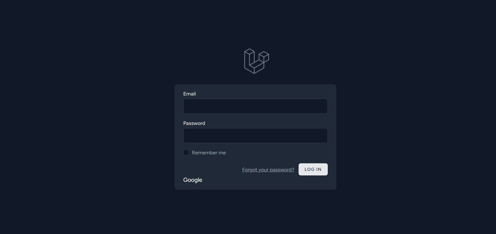
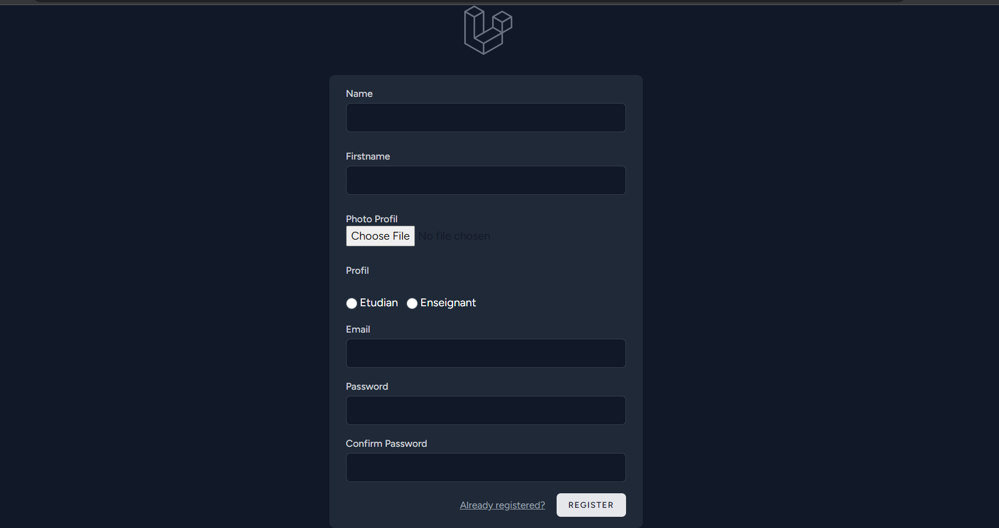
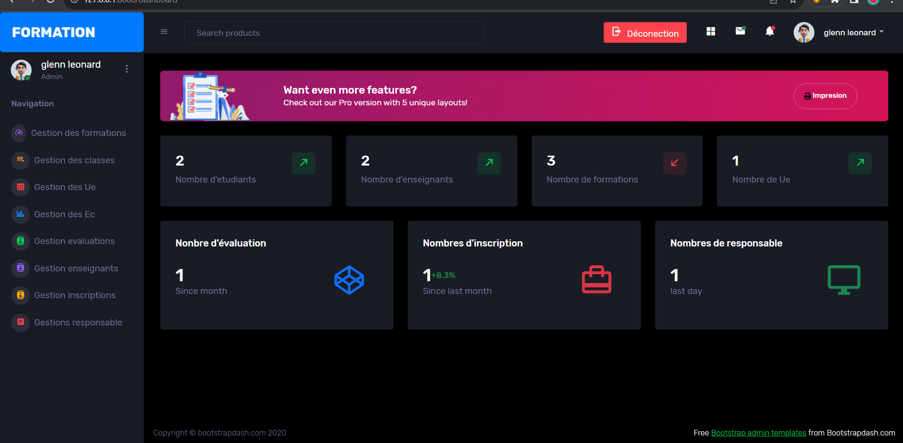
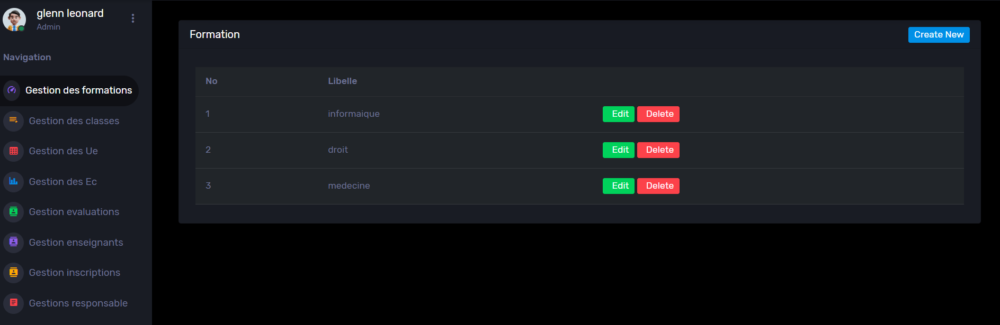
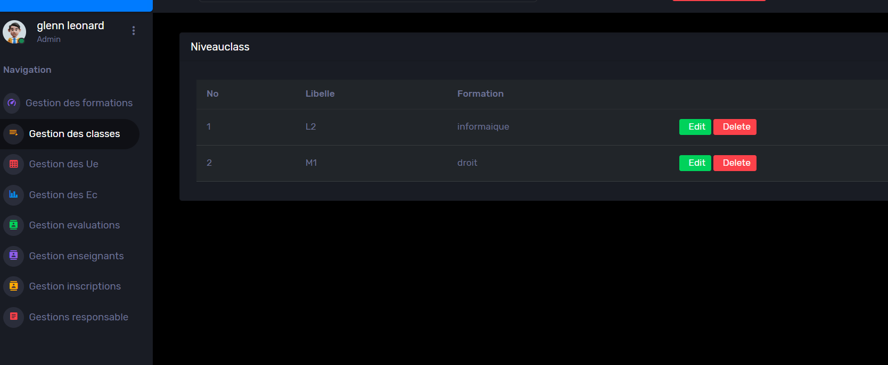
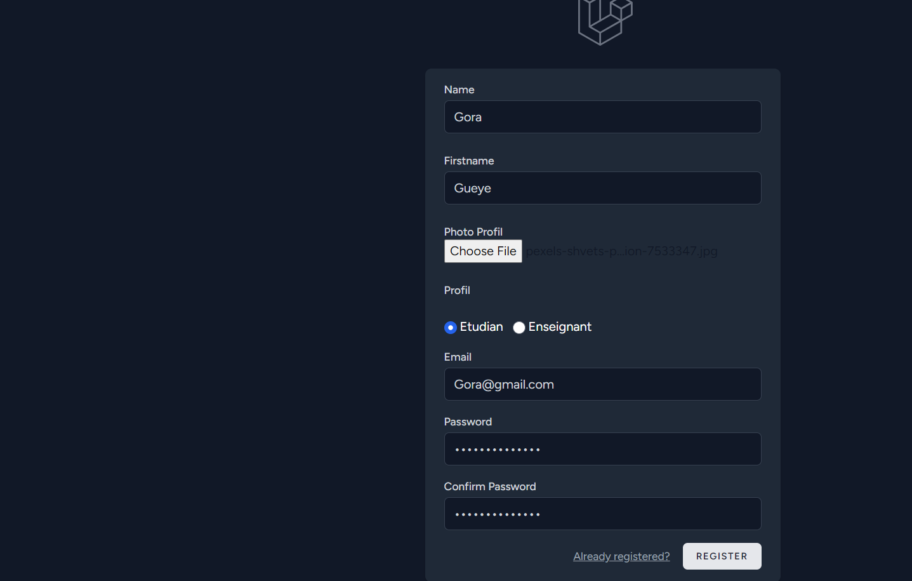

# 🎓 FORMATION - Système de Gestion Académique

<div align="center">


**Application web complète de gestion académique pour établissements d'enseignement supérieur**

[Fonctionnalités](#-fonctionnalités) • [Installation](#-installation) • [Captures d'écran](#-captures-décran) • [Technologies](#-stack-technique) • [Auteur](#-auteur)

</div>

---

## 📖 À Propos

**FORMATION** est une plateforme de gestion académique développée avec Laravel 10, permettant la gestion complète du cycle académique : formations, classes, unités d'enseignement (UE), éléments constitutifs (EC), évaluations, inscriptions, enseignants et responsables.

### 🎯 Contexte du Projet

> Ce projet a été réalisé en **2023** dans le cadre de mon parcours académique. Il m'a permis d'acquérir une maîtrise approfondie de :
> - **Eloquent ORM** : Relations complexes, requêtes optimisées, eager loading
> - **Laravel Breeze** : Système d'authentification robuste et personnalisable
> - **OAuth 2.0** : Intégration de Google Sign-In avec Laravel Socialite
> - **Architecture MVC** : Organisation professionnelle du code

---

## ✨ Fonctionnalités

### 🔐 Authentification Multi-méthodes

| Méthode | Description |
|---------|-------------|
| **Email/Password** | Authentification classique via Laravel Breeze |
| **Google OAuth** | Connexion rapide avec compte Google |
| **Remember Me** | Session persistante optionnelle |
| **Password Reset** | Récupération de mot de passe par email |

### 👥 Gestion des Utilisateurs

```
┌─────────────────────────────────────────────────────────────┐
│                    RÔLES DISPONIBLES                        │
├─────────────┬───────────────────────────────────────────────┤
│   Admin     │ Accès complet - Dashboard & toutes les       │
│             │ fonctionnalités de gestion                    │
├─────────────┼───────────────────────────────────────────────┤
│ Enseignant  │ Gestion des cours, évaluations, étudiants    │
├─────────────┼───────────────────────────────────────────────┤
│  Étudiant   │ Consultation formations, notes, inscriptions │
├─────────────┼───────────────────────────────────────────────┤
│ Responsable │ Supervision des formations assignées         │
└─────────────┴───────────────────────────────────────────────┘
```

### 📊 Dashboard Administrateur

Le tableau de bord offre une vue d'ensemble en temps réel :

- 📈 **Nombre d'étudiants** inscrits
- 👨‍🏫 **Nombre d'enseignants** enregistrés  
- 📚 **Nombre de formations** disponibles
- 📖 **Nombre d'UE** créées
- ✅ **Nombre d'évaluations** (suivi mensuel)
- 📋 **Nombre d'inscriptions** (avec % d'évolution)
- 👔 **Nombre de responsables**
- 🖨️ **Fonction d'impression** des statistiques

### 🏫 Modules de Gestion

| Module | Fonctionnalités |
|--------|-----------------|
| **Formations** | CRUD complet (Informatique, Droit, Médecine...) |
| **Classes/Niveaux** | Gestion L1, L2, L3, M1, M2 avec association aux formations |
| **Unités d'Enseignement** | Création et association aux formations |
| **Éléments Constitutifs** | Gestion des EC rattachés aux UE |
| **Évaluations** | Création, suivi et attribution des notes |
| **Inscriptions** | Gestion des inscriptions étudiants |
| **Enseignants** | Profils et affectations |
| **Responsables** | Supervision des formations |

---

## 🛠 Stack Technique

### Backend
```
Laravel 10.x      → Framework PHP principal
Laravel Breeze    → Authentification
Laravel Socialite → OAuth Google
Eloquent ORM      → Gestion base de données
```

### Frontend
```
Blade             → Moteur de templates
Tailwind CSS 3.x  → Framework CSS utilitaire
Vite 5.x          → Build tool & HMR
Star Admin 2      → Template dashboard
```

### Base de données
```
MySQL 8.0+        → SGBD relationnel
Migrations        → Versioning du schéma
Seeders           → Données de test
```

---

## 📁 Structure du Projet

```
projet_Laravel_2024/
│
├── 📂 app/
│   ├── 📂 Http/
│   │   ├── 📂 Controllers/
│   │   │   ├── FormationController.php
│   │   │   ├── NiveauclassController.php
│   │   │   ├── UeController.php
│   │   │   ├── EcController.php
│   │   │   ├── EvaluationController.php
│   │   │   ├── EnseignantController.php
│   │   │   ├── InscriptionController.php
│   │   │   ├── ResponsableController.php
│   │   │   └── 📂 Auth/
│   │   │       └── GoogleController.php
│   │   └── 📂 Middleware/
│   │
│   └── 📂 Models/
│       ├── User.php
│       ├── Formation.php
│       ├── Niveauclass.php
│       ├── Ue.php
│       ├── Ec.php
│       ├── Evaluation.php
│       ├── Inscription.php
│       └── Responsable.php
│
├── 📂 database/
│   ├── 📂 migrations/
│   └── 📂 seeders/
│
├── 📂 resources/
│   └── 📂 views/
│       ├── 📂 auth/
│       ├── 📂 formations/
│       ├── 📂 classes/
│       └── dashboard.blade.php
│
├── 📂 routes/
│   ├── web.php
│   └── auth.php
│
├── 📂 capture/                 # 📸 Captures d'écran
│   ├── Capture.PNG
│   ├── 2Capture.PNG
│   ├── 3Capture.PNG
│   └── ...
│
├── 📂 public/
├── tailwind.config.js
├── vite.config.js
├── composer.json
└── package.json
```

---

## ⚙️ Installation

### Prérequis

- PHP >= 8.1
- Composer
- Node.js >= 18.x & NPM
- MySQL >= 8.0

### Étapes d'installation

```bash
# 1. Cloner le repository
git clone https://github.com/glenn2016/projet_Laravel_2024.git
cd projet_Laravel_2024

# 2. Installer les dépendances PHP
composer install

# 3. Installer les dépendances Node.js
npm install

# 4. Configurer l'environnement
cp .env.example .env
php artisan key:generate

# 5. Configurer la base de données dans .env
# DB_DATABASE=formation
# DB_USERNAME=votre_username
# DB_PASSWORD=votre_password

# 6. Configurer Google OAuth dans .env
# GOOGLE_CLIENT_ID=votre_client_id
# GOOGLE_CLIENT_SECRET=votre_client_secret
# GOOGLE_REDIRECT_URI=http://127.0.0.1:8000/auth/google/callback

# 7. Exécuter les migrations
php artisan migrate

# 8. (Optionnel) Seed de données
php artisan db:seed

# 9. Créer le lien storage
php artisan storage:link

# 10. Compiler les assets
npm run build

# 11. Lancer le serveur
php artisan serve
```

### Accès à l'application

```
🌐 URL: http://127.0.0.1:8000
```

---

## 📸 Captures d'écran

Les captures d'écran sont disponibles dans le dossier `capture/` :

### Authentification

| Connexion | Inscription |
|-----------|-------------|
|  |  |
| Connexion email + Google OAuth | Formulaire étudiant/enseignant |

### Dashboard & Gestion

| Dashboard Admin | Gestion Formations |
|-----------------|-------------------|
|  |  |
| Statistiques temps réel | CRUD formations |

| Gestion Classes | Interface Étudiant |
|-----------------|-------------------|
|  |  |
| Niveaux & formations | Vue étudiant |

---

## 🔗 Relations Eloquent

```php
// Formation → Classes (One-to-Many)
class Formation extends Model
{
    public function niveauclasses()
    {
        return $this->hasMany(Niveauclass::class);
    }
}

// Niveauclass → Formation (Belongs To)
class Niveauclass extends Model
{
    public function formation()
    {
        return $this->belongsTo(Formation::class);
    }
}

// User → Inscriptions (One-to-Many)
class User extends Model
{
    public function inscriptions()
    {
        return $this->hasMany(Inscription::class);
    }
}
```

---

## 📝 Routes Principales

```php
// Authentification (Laravel Breeze)
Route::get('/login', [AuthenticatedSessionController::class, 'create']);
Route::get('/register', [RegisteredUserController::class, 'create']);

// Google OAuth
Route::get('/auth/google', [GoogleController::class, 'redirect']);
Route::get('/auth/google/callback', [GoogleController::class, 'callback']);

// Dashboard
Route::get('/dashboard', [DashboardController::class, 'index']);

// Ressources CRUD
Route::resource('formations', FormationController::class);
Route::resource('classes', NiveauclassController::class);
Route::resource('ue', UeController::class);
Route::resource('ec', EcController::class);
Route::resource('evaluations', EvaluationController::class);
Route::resource('enseignants', EnseignantController::class);
Route::resource('inscriptions', InscriptionController::class);
Route::resource('responsables', ResponsableController::class);
```

---

## 🎯 Compétences Développées

Ce projet m'a permis de maîtriser :

| Compétence | Description |
|------------|-------------|
| ✅ **Eloquent ORM** | Relations, requêtes avancées, eager loading, scopes |
| ✅ **Laravel Breeze** | Authentification complète, personnalisation |
| ✅ **OAuth 2.0** | Intégration Google Sign-In |
| ✅ **Tailwind CSS** | Design responsive et moderne |
| ✅ **Vite** | Build optimisé, Hot Module Replacement |
| ✅ **Architecture MVC** | Organisation professionnelle du code |
| ✅ **CRUD** | Opérations complètes avec validation |
| ✅ **Middleware** | Protection des routes par rôle |
| ✅ **Blade** | Templates dynamiques et réutilisables |

---

## 🚀 Commandes Utiles

```bash
# Développement
npm run dev              # Lancer Vite en mode dev
php artisan serve        # Lancer le serveur Laravel

# Base de données
php artisan migrate:fresh --seed    # Reset + seed
php artisan migrate:status          # État des migrations

# Cache
php artisan optimize                # Optimiser pour production
php artisan cache:clear             # Vider le cache

# Debug
php artisan route:list              # Lister les routes
php artisan tinker                  # Console interactive
```

---

---

## 👨‍💻 Auteur

<div align="center">

**Projet réalisé en 2023**

Dans le cadre de mon parcours académique

[](https://github.com/glenn2016)

---

⭐ **Si ce projet vous a été utile, n'hésitez pas à lui donner une étoile !** ⭐

</div>
